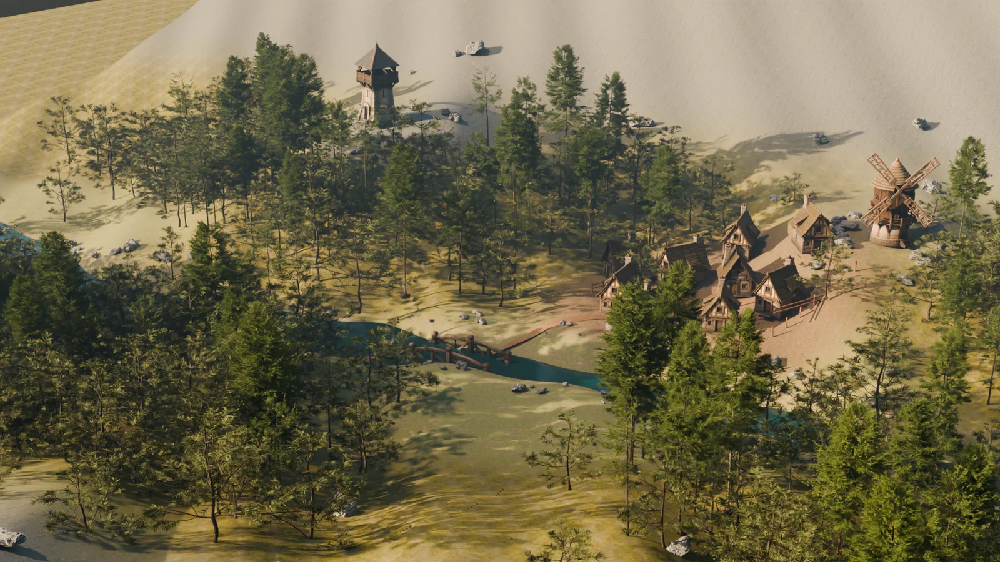
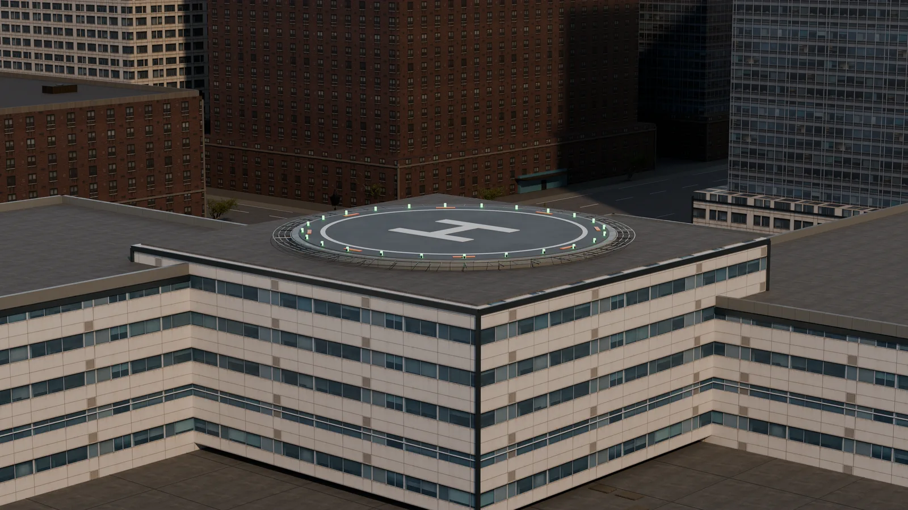
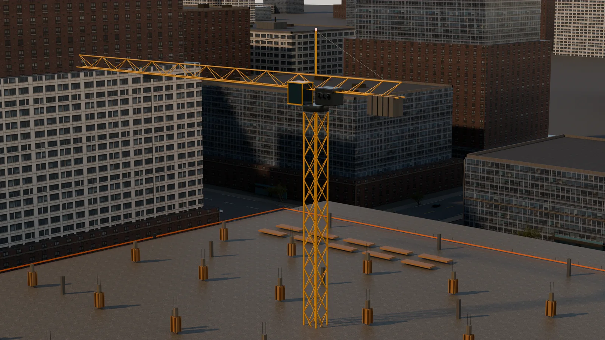

# WorldClaw 本地复现工程

[English](README.md) | **简体中文**

这是对腾讯混元论文 **《WorldClaw: Agentic 3D Open-World Generation at
Scale》** 的非官方、洁净室工程复现。

> 本项目依据论文及公开项目资料独立实现，不是腾讯官方 WorldClaw
> 代码，不包含未公开源码、官方游戏资产或模型权重，也不代表腾讯对本项目的
> 认可、赞助或维护。

WorldClaw 本地复现工程能够将结构化场景描述转换为可编辑的 3D 世界。完整流程
涵盖场景规划、语义地形、可复用资产、区域级组装、2D 到 3D 重建、位置恢复、
Blender 场景构建、基于渲染的迭代优化、质量验证和网页端交付。

原始工作：

- 论文：<https://arxiv.org/abs/2608.05248>
- 官方项目主页：<https://tencent-hunyuan.github.io/Hunyuan3D-WorldClaw/>
- 官方项目仓库：<https://github.com/Tencent-Hunyuan/Hunyuan3D-WorldClaw>

本复现仓库：
<https://github.com/shangjunyang1986/worldclaw-local-reproduction>

## 实际生成效果

以下图片均为本流程组装可编辑 3D 场景后，由 Blender 实际渲染得到的结果，
不是生成前的参考图，也不是仅由图像模型生成的平面效果图。公开仓库只收录压缩
后的文档预览图，不包含模型权重、生产级 BLEND/GLB 文件或完整渲染归档。



*边境山谷世界——Cycles 全局渲染；场景包含 4,236 个对象，以及分区地形、
河流廊道、植被、村庄和地标布局。*

| 米制城市验证场景 | 显式结构几何 |
|---|---|
|  |  |
| 解析圆形停机坪与严格平整的屋面。 | 由直杆件组成的塔吊与经过测量的施工布局。 |

城市验证场景以显式米制网格定义形状、碰撞和导航；生成式位图只影响材质外观。
源文件哈希、图片转换方式、许可边界及精确的验证指标请参阅
[效果图溯源记录](docs/public/assets/README.md)。

## 已复现的能力

- 带版本的 `WorldSpec`、资产注册表、测量契约和质量契约；
- 语义布局和区域感知的程序化地形生成；
- 可选的 SAM 3 文本分割与 SAM 3D Objects 三维重建；
- 可选的 Hunyuan3D 2.1 几何与 PBR 细化；
- 相机感知的区域级物体放置和 Blender 场景组装；
- 参考层、视觉层、碰撞层和导航层的明确分离；
- 具有证据记录的参考图、灰盒、材质和最终效果审核门；
- 支持断点恢复的本地任务、GPU 资源感知执行、验证、打包和 Web Studio；
- 浏览器无法使用 WebGL/WebGPU 时自动切换到静态预览。

论文使用的私有提示词、内部 Agent、未公开工具、训练数据和精确配置并未公开。
本项目对相应组件进行了独立工程替代，不声明数值或像素级完全一致。

## 快速开始

核心程序和 Web Studio 需要 Python 3.12、`uv` 以及 Node.js 20 或更高版本。
只有在工作流实际调用 Blender 或本地模型时，才需要安装对应环境。

```bash
scripts/setup_web.sh
webapp/.venv/bin/worldclaw doctor
scripts/start_web.sh
```

浏览器打开 <http://127.0.0.1:7865>。

仅安装核心程序：

```bash
uv sync --extra dev
uv run worldclaw doctor
uv run worldclaw plan --prompt "一座被河流穿过、包含村庄的森林山谷"
uv run pytest -q
```

常用命令：

```text
worldclaw init       创建可迁移的本地配置
worldclaw doctor     检查 Blender、模型、检查点和 GPU 可用性
worldclaw plan       生成结构化、确定性的世界规划
worldclaw build      使用 Blender 构建规划结果
worldclaw validate   验证已完成的交付物
worldclaw package    创建带文件哈希的交付清单
worldclaw resume     重试中断的 Web Studio 任务
worldclaw serve      启动 Web Studio
```

进一步阅读：[安装说明](docs/public/INSTALLATION.md)、
[系统架构](docs/public/ARCHITECTURE.md)、
[可复现性说明](docs/public/REPRODUCIBILITY.md)、
[论文复现边界](docs/public/PAPER_REPRODUCTION.md)、
[发布流程](docs/public/RELEASE.md)和[资产政策](ASSET_POLICY.md)。

## 模型边界

SAM 3、SAM 3D Objects 和 Hunyuan3D 都是由用户自行安装和管理的外部依赖。
本仓库不再分发它们的源码树或模型检查点。用户需要从官方项目获取模型、接受
当前许可证，并在 `.env` 中或通过 `WORLDCLAW_*` 环境变量配置路径。详见
[模型许可证说明](MODEL_LICENSES.md)。

## 公开样例与私有验证场景

公开样例是原创、与 CC0 兼容的边境山谷测试夹具。大型生产输出以及王者荣耀、
丹佛机场等带品牌的验证场景不会随源码发布。只有在完成独立权利审查后，才可将
相应本地清单用于契约系统测试或对外展示。

## 公开发布审计

公开目录由显式白名单构建。审计会拒绝密钥、机器相关绝对路径、符号链接、
未经允许的二进制文件以及超过 10 MiB 的文件：

```bash
python3 scripts/build_public_release.py --check-only
python3 scripts/build_public_release.py
```

生成的洁净发布目录位于
`release_staging/worldclaw-local-reproduction/`，并附带 SHA-256 清单。

## 引用

引用本项目时，请同时引用原论文，并明确说明本仓库是非官方复现：

```bibtex
@article{guo2026worldclaw,
  title={WorldClaw: Agentic 3D Open-World Generation at Scale},
  author={Guo, Chunchao and Li, Jinpeng and Li, Yang and Huang, Zilong},
  journal={arXiv preprint arXiv:2608.05248},
  year={2026}
}
```

## 许可证

本仓库原创代码和文档采用 Apache-2.0 许可证。第三方模型、资产、输入和生成输出
仍受各自条款约束。详见 [NOTICE](NOTICE) 和
[第三方许可证说明](THIRD_PARTY_LICENSES.md)。
